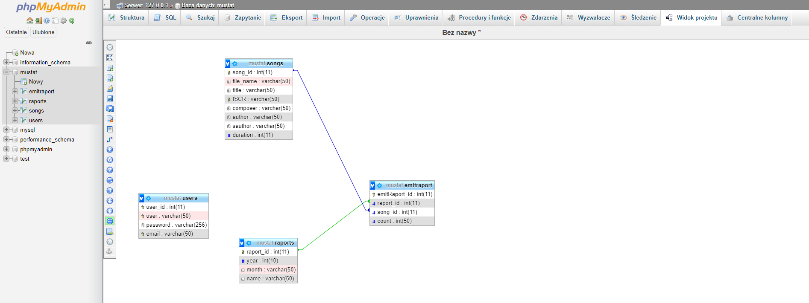
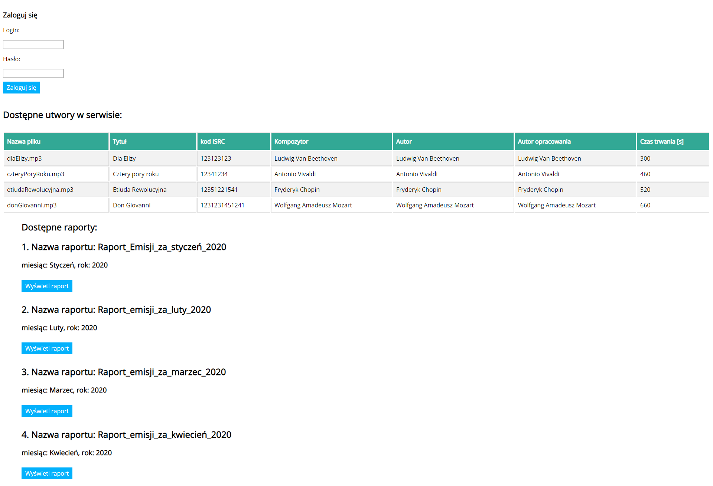
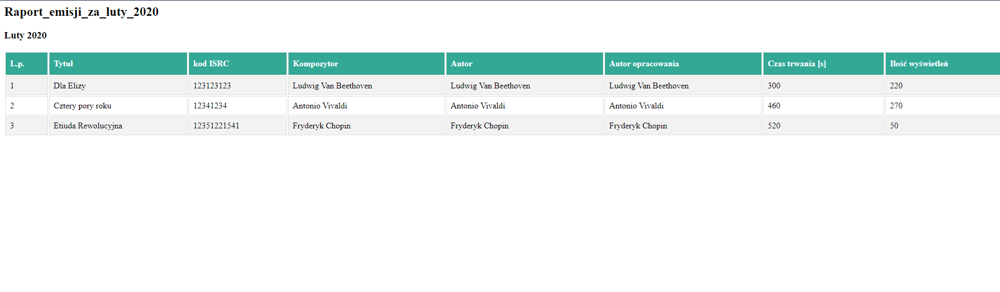
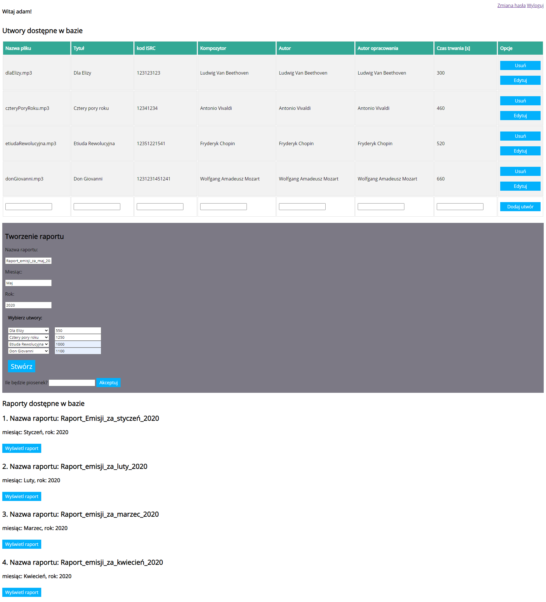
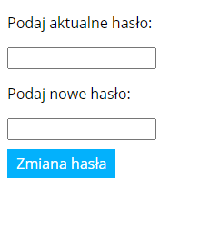

# projektPHP
System do raportowania emisji utworów muzycznych

## Table of contents
* [Informacje ogólne](#informacje-ogólne)
* [Technologie](#technologie)
* [Funkcjonalności](#funkcjonalności)
* [Baza danych](#baza-danych)
* [Zrzuty ekranu](#zrzuty-ekranu)
* [Konfiguracja projektu](#konfiguracja-projektu)
* [Opis kodu](#opis-kodu)
* [Link do projektu](#link-do-projektu)

## Informacje ogólne
Projekt PHP z przedmiotu Zaawansowane Aplikacje Internetowe - Okno PW. Autor: Maciej Karasiński

## Technologie
* PHP
* mysql XAMP (PHPMyAdmin)
* CSS

## Funkcjonalności
* dodawanie/edycja/usuwanie utworów przez zalogowanego użytkownika
* tworzenie raportów przez zalogowanego użytkownika
* prezentacja zbioru utworów i raportów bez zalogowania
* drukowanie raportu bez kontrolek dotyczących edycji
* Autoryzacja użytkownika (inne funkcjonalności dla zalogowanego i niezalogowanego użytkownika)
* Zabezpieczenie przed SQLInjection, hashowanie haseł w bazie danych
* Możliwość zmiany hasła przez użytkownika

## Baza danych
Schemat bazy danych stworzonej w projekcie:

Baza składa się z czterech tabeli. Tabela users przechowuje dane do logowania użytkowników. Tabela songs przechowuje dane o utworach. Tabela raports przechowuje dane o raportach. Tabela emitraport służy do połączenia tabel songs i raports w celu wygenerowania wymaganego raportu. Zawiera klucze obce obydwu tych tabel.

Skrypty tworzące bazę danych znajdują się w pliku mustat.sql

  

## Zrzuty ekranu   
* Widok niezalogowanego użytkownika   
Niezalogowanemu użytkownikowi prezentowane są utwory oraz raporty dostępne w bazie. Nie może on nic edytować.

  

Raporty wyświetlane są bez kontrolek do edycji, aby można było je wydrukować.
* Widok raportu  

  

Użytkownik zalogowany ma dodatkowo możliwość zmiany/dodania/usunięcia utworów oraz tworzenia raportów. Brakuje funkcjonalności do edytowania/usuwania raportów.
* Widok zalogowanego użytkownika 

  

Użytkownik zalogowany może zmienić hasło
* Zmiana hasła  

  

## Konfiguracja projektu
Dostępni użytkownicy:
adam qwerty123,
kasia start55,
roman haslo12345

Aplikacja jest dostępna online na serwisie heroku https://php-projekt.herokuapp.com/index.php

Aby uruchomić projekt lokalnie można wykorzystać pakiet XAMPP
https://www.apachefriends.org/pl/index.html
Należy uruchomić usługi Apache i MySQL w XAMPP
Umieścić pliki projektu w folderze ../XAMPP/htdocs/nazwafolderu
Importować bazę danych znajdującą się w pliku mustat.sql do PHPMyAdmin (dostępnego w XAMPP)
Wejść na stronę localhost/nazwafolderu (tego w htdocs)

## Opis kodu
* index.php - widok dla niezalogowanego użytkownika, opcja logowania, zabezpieczenie przed sqlijection, wyświetlanie utworów/raportów
* raports.php - widok dla zalogowanego użytkownika, funkcjonalności dodawania/edycji/usuwania utworów, tworzenia/wyświetlania raportów, opcja wylogowania/zmiany hasła
* addSong.php, editSong.php, deleteSong.php operacje CRUD na bazie danych dla tabeli z utworami
* fetchRaports.php i createRaport.php funkcjonalności tworzenia i wyświetlania raportów
* login.php, logout.php, changePassword.php - funcjonalności logowania, wylogowania, zmiany hasła
* mustat.sql plik bazy danych wyeksportowany z PHPMyAdmin

## Link do projektu
Projekt znajduje się pod linkiem https://php-projekt.herokuapp.com/index.php
